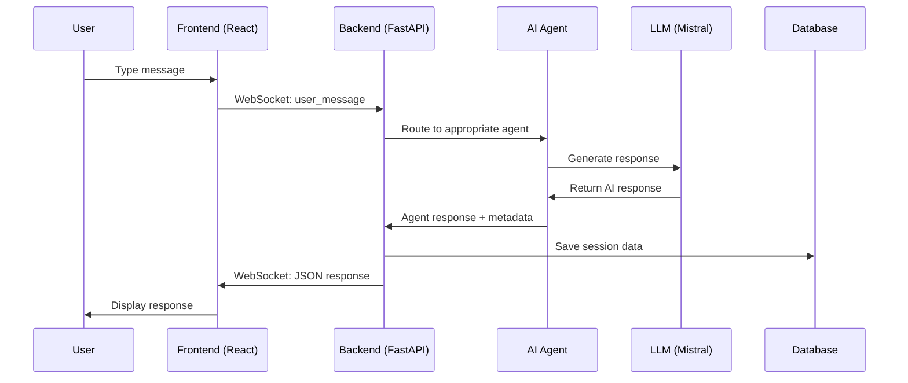
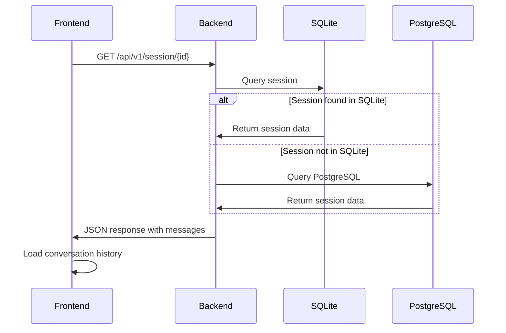
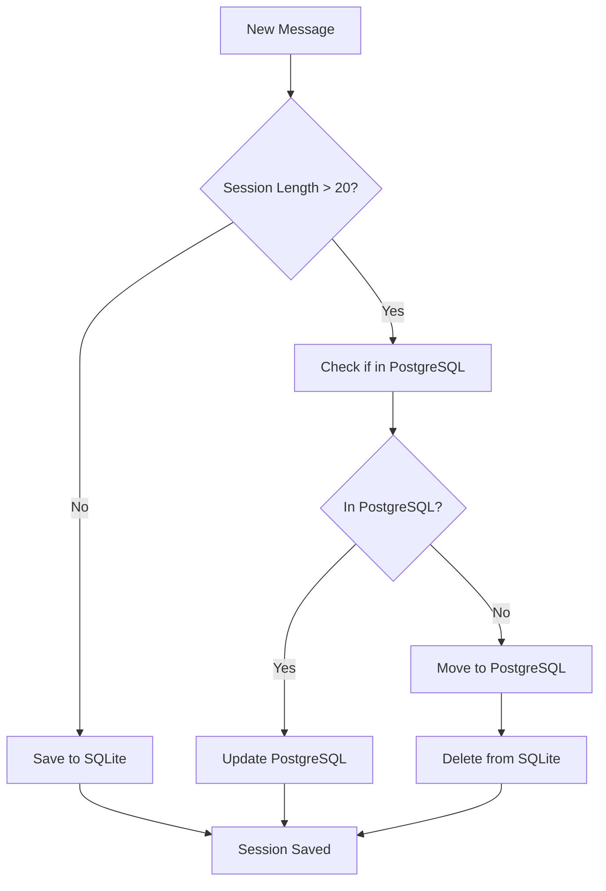

# Agentic Chatbot - End-to-End Workflow

## Complete System Architecture & Data Flow

```mermaid
graph TB
    %% User Interface Layer
    subgraph UI["🖥️ Frontend Layer (React/TypeScript)"]
        A1["User Interface<br/>Chat.tsx"]
        A2["WebSocket Client<br/>ws://localhost:8000/api/v1/chat"]
        A3["REST API Client<br/>axios"]
        A4["Local Storage<br/>sessionId"]
        A5["State Management<br/>useState, useEffect"]
    end
    
    %% API Gateway Layer
    subgraph API["🔧 API Gateway Layer (FastAPI)"]
        B1["FastAPI App<br/>app.py"]
        B2["WebSocket Endpoint<br/>/api/v1/chat"]
        B3["REST Endpoint<br/>/api/v1/session/{id}"]
        B4["Session Manager<br/>session_store"]
    end
    
    %% AI Agent Layer
    subgraph AGENTS["🤖 AI Agent Layer (LangGraph)"]
        C1["Router Agent<br/>router_agent.py"]
        C2["Booking Agent<br/>booking_agent.py"]
        C3["Flight Status Agent<br/>flight_status_agent.py"]
        C4["Baggage Agent<br/>baggage_agent.py"]
        C5["Conversation State<br/>conversation_state.py"]
    end
    
    %% LLM Layer
    subgraph LLM["🧠 LLM Layer (Mistral-7B)"]
        D1["Mistral LLM<br/>mistral-7b-instruct-v0.2.Q4_K_M.gguf"]
        D2["LLM Loader<br/>llm_loader.py"]
        D3["Base LLM<br/>base_llm.py"]
        D4["GPU Acceleration<br/>Apple M3 Max Metal"]
    end
    
    %% Database Layer
    subgraph DB["🗄️ Database Layer (SQLite + PostgreSQL)"]
        E1["SQLite Database<br/>chat_sessions.db"]
        E2["PostgreSQL Database<br/>postgresql://postgres@localhost/chatbot"]
        E3["Session Model<br/>chat_session.py"]
        E4["Migration Logic<br/>move_session_to_postgres()"]
    end
    
    %% Tools & Utilities
    subgraph TOOLS["🛠️ Tools & Utilities"]
        F1["Vector Database<br/>FAISS"]
        F2["Flight API<br/>flight_api.py"]
        F3["Prompt Loader<br/>prompt_loader.py"]
        F4["Configuration<br/>config.py"]
    end
    
    %% Data Flow Connections
    %% User Input Flow
    A1 -->|"User Message"| A2
    A2 -->|"WebSocket Message"| B2
    B2 -->|"Create Session"| B4
    B2 -->|"Route Query"| C1
    
    %% Agent Processing Flow
    C1 -->|"Intent Classification"| C2
    C1 -->|"Intent Classification"| C3
    C1 -->|"Intent Classification"| C4
    C2 -->|"LLM Query"| D2
    C3 -->|"LLM Query"| D2
    C4 -->|"LLM Query"| D2
    D2 -->|"Load Model"| D1
    D1 -->|"GPU Inference"| D4
    
    %% External API Integration
    C3 -->|"Flight Data"| F2
    C2 -->|"Booking Data"| F2
    
    %% Database Operations
    B2 -->|"Save Session"| E3
    E3 -->|"Short Session"| E1
    E3 -->|"Long Session"| E2
    E3 -->|"Auto Migration"| E4
    
    %% Session History Flow
    A1 -->|"Page Refresh"| A3
    A3 -->|"GET /api/v1/session/{id}"| B3
    B3 -->|"Query Database"| E3
    E3 -->|"Return History"| B3
    B3 -->|"JSON Response"| A3
    A3 -->|"Load Messages"| A1
    
    %% State Management
    A1 -->|"Store SessionId"| A4
    A4 -->|"Retrieve on Load"| A1
    B2 -->|"Update State"| C5
    C5 -->|"Agent Response"| B2
    
    %% Response Flow
    B2 -->|"JSON Response"| A2
    A2 -->|"Update UI"| A1
    A1 -->|"Display Message"| A5
    
    %% Configuration & Tools
    D2 -->|"Load Config"| F4
    C1 -->|"Load Prompts"| F3
    C1 -->|"Vector Search"| F1
    
    %% Styling
    classDef uiClass fill:#2196f3,stroke:#0d47a1,stroke-width:3px,color:#fff
    classDef apiClass fill:#9c27b0,stroke:#4a148c,stroke-width:3px,color:#fff
    classDef agentClass fill:#ff9800,stroke:#e65100,stroke-width:3px,color:#fff
    classDef llmClass fill:#4caf50,stroke:#1b5e20,stroke-width:3px,color:#fff
    classDef dbClass fill:#f44336,stroke:#b71c1c,stroke-width:3px,color:#fff
    classDef toolsClass fill:#607d8b,stroke:#263238,stroke-width:3px,color:#fff
    
    class A1,A2,A3,A4,A5 uiClass
    class B1,B2,B3,B4 apiClass
    class C1,C2,C3,C4,C5 agentClass
    class D1,D2,D3,D4 llmClass
    class E1,E2,E3,E4 dbClass
    class F1,F2,F3,F4 toolsClass
```

## Detailed Technical Workflow

### 1. **User Interaction Flow**

### 2. **Session Management Flow**

### 3. **Database Migration Flow**

## Technical Specifications

### **Frontend (React/TypeScript)**
- **Framework**: React 19.1.0 with TypeScript
- **WebSocket**: Native WebSocket API
- **HTTP Client**: Axios for REST calls
- **State Management**: React hooks (useState, useEffect, useRef)
- **Styling**: Tailwind CSS
- **Port**: 3000

### **Backend (FastAPI/Python)**
- **Framework**: FastAPI 0.110.1
- **WebSocket**: FastAPI WebSocket support
- **ORM**: SQLAlchemy 2.0.41
- **Port**: 8000
- **Dependencies**: LangChain, LangGraph, llama-cpp-python

### **AI/ML Stack**
- **LLM**: Mistral-7B-Instruct-v0.2 (4.07 GiB, Q4_K_M quantization)
- **Framework**: LangChain 0.1.20, LangGraph 0.0.47
- **GPU**: Apple M3 Max Metal acceleration
- **Agents**: Router, Booking, Flight Status, Baggage

### **Database Stack**
- **Primary**: SQLite (chat_sessions.db, 40KB)
- **Secondary**: PostgreSQL (configured, not active)
- **Migration**: Automatic based on session length
- **Schema**: chat_sessions table with JSON message storage

### **Integration Points**
- **WebSocket**: ws://localhost:8000/api/v1/chat
- **REST API**: http://localhost:8000/api/v1/session/{session_id}
- **Session Storage**: localStorage for sessionId
- **Real-time**: WebSocket for instant messaging
- **Persistence**: Database for conversation history

### **Data Flow Summary**
1. **User Input** → Frontend WebSocket → Backend API
2. **Intent Classification** → Router Agent → Specialized Agent
3. **LLM Processing** → Mistral-7B → GPU Inference
4. **Response Generation** → Agent → Backend → Frontend
5. **Session Storage** → SQLite/PostgreSQL → Database
6. **History Retrieval** → REST API → Frontend Display 