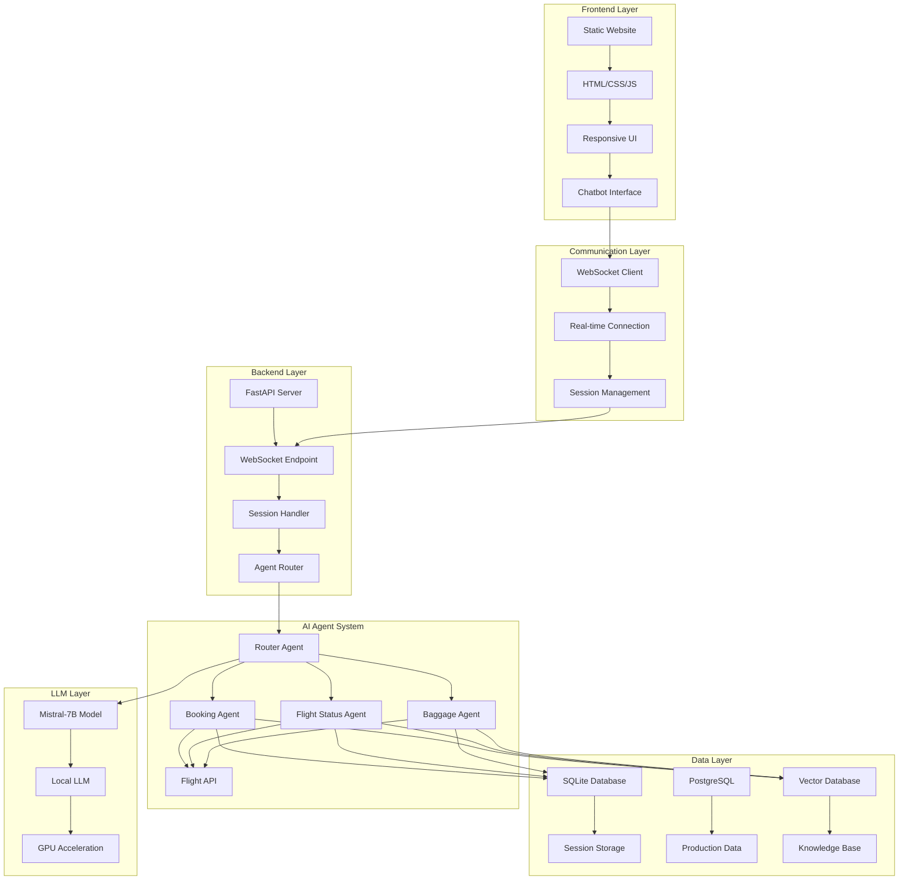
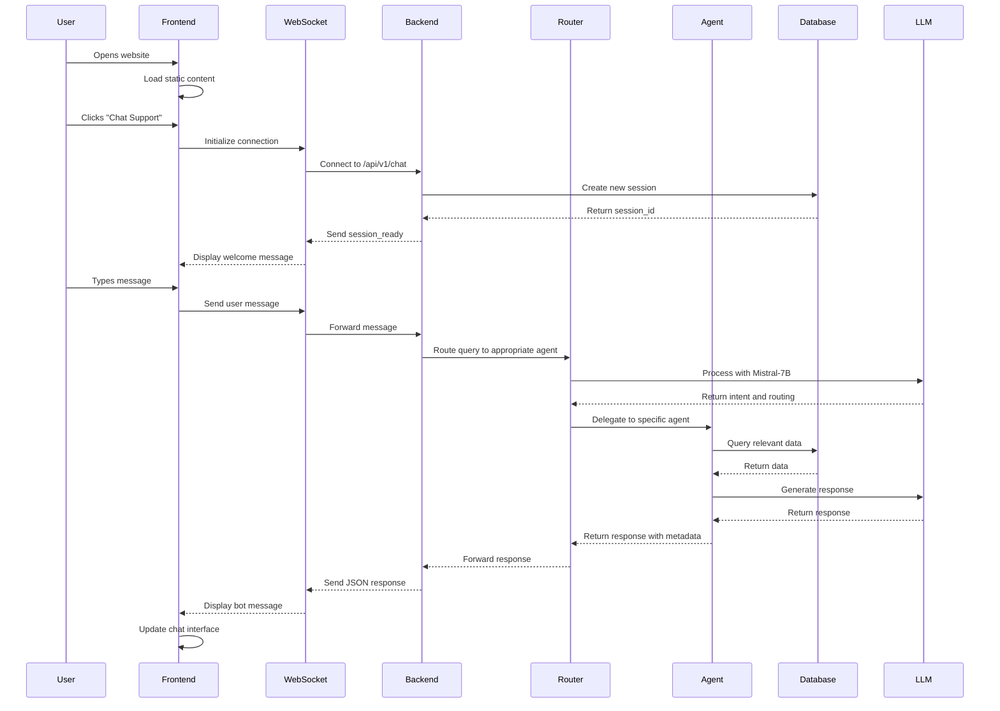
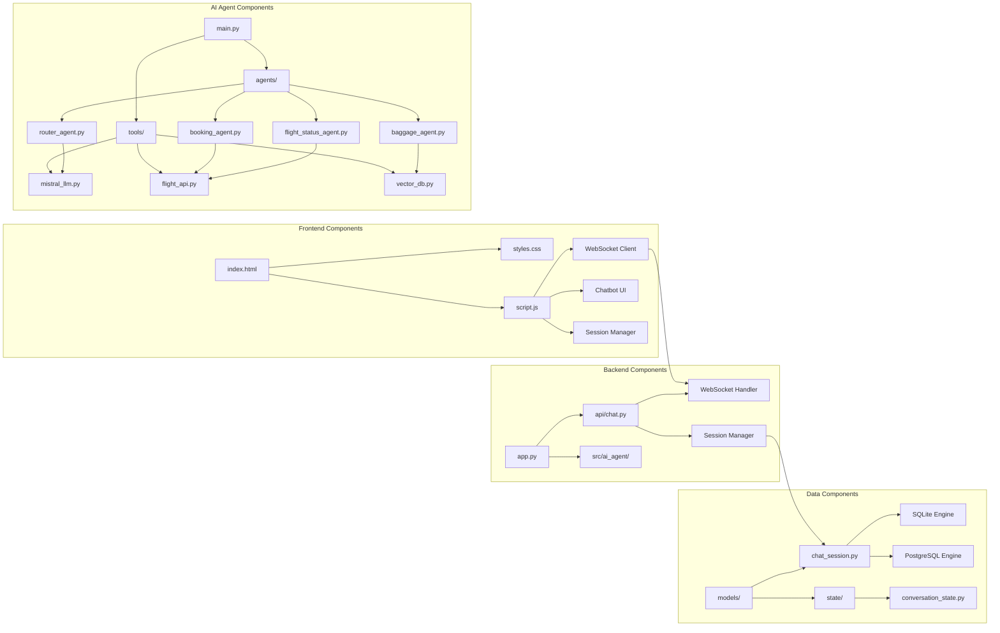
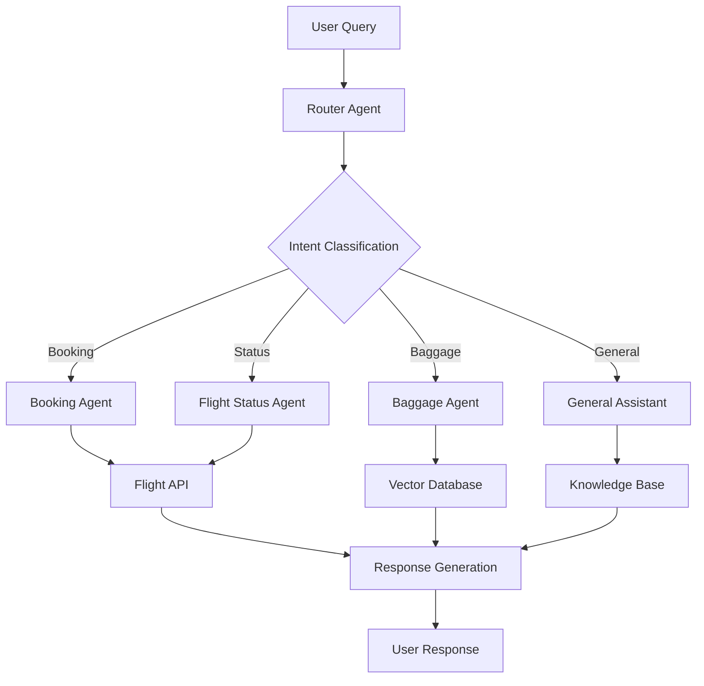

# Skyline Airway - Static Website with BARRY Chatbot

A modern, responsive static website for Skyline Airway featuring an intelligent chatbot assistant named BARRY. The website showcases premium airline services with a fully functional chat interface that connects to the backend AI agent system.

## 🌟 Features

### **Website Features**
- **Responsive Design**: Works perfectly on desktop, tablet, and mobile devices
- **Modern UI/UX**: Clean, professional design with smooth animations
- **Navigation**: Smooth scrolling navigation with mobile hamburger menu
- **Sections**: Hero, Destinations, Services, About, and Contact sections
- **Interactive Elements**: Hover effects, loading animations, and form handling

### **BARRY Chatbot Features**
- **Centered Position**: Opens in the middle of the screen for better visibility
- **Expandable Interface**: Toggle between normal (400x500px) and expanded (600x700px) sizes
- **Close Button**: Easy-to-use close button with red hover effect
- **Real-time Communication**: WebSocket connection to backend AI agents
- **Typing Indicators**: Shows when BARRY is processing responses
- **Session Management**: Maintains conversation context across sessions
- **Error Handling**: Automatic reconnection and user-friendly error messages
- **Clean Interface**: No technical metadata displayed to users

## 🏗️ System Architecture

### **High-Level Design (HLD)**



### **Low-Level Design (LLD)**



### **Component Architecture**



## 🚀 Quick Start

### **Prerequisites**
- Python 3.7+ installed
- Backend server running on port 8000 (optional for full functionality)

### **Setup Instructions**

1. **Navigate to the static website directory:**
   ```bash
   cd "IISc Capstone Project/Agentic-Chatbot-main_UI/static_website"
   ```

2. **Start the local server:**
   ```bash
   python3 -m http.server 8080
   ```

3. **Open your browser and visit:**
   ```
   http://localhost:8080
   ```

### **Backend Integration (Optional)**
For full chatbot functionality, ensure the backend server is running:
```bash
cd "IISc Capstone Project/Agentic-Chatbot-main_UI"
source venv/bin/activate
python app.py
```

## 📁 File Structure

```
static_website/
├── index.html          # Main website with chatbot integration
├── styles.css          # Complete styling for website and chatbot
├── script.js           # JavaScript for interactions and WebSocket
├── test-chat.html      # Chatbot testing interface
├── barry-icon.png      # Placeholder for BARRY icon
└── README.md           # This file
```

## 🎮 How to Use

### **Website Navigation**
- **Hero Section**: Click "Book Flight" or "View Destinations" buttons
- **Navigation**: Use the top menu or smooth scroll to sections
- **Mobile**: Use hamburger menu for mobile navigation

### **BARRY Chatbot**
1. **Open Chatbot**: Click "Chat Support" button in navigation or floating button
2. **Expand/Collapse**: Click expand button (↗) in chatbot header
3. **Close**: Click red X button to close
4. **Chat**: Type messages and press Enter or click send button

### **Testing Chatbot**
Visit `http://localhost:8080/test-chat.html` for detailed WebSocket testing and debugging.

## 🔧 Technical Details

### **Frontend Technologies**
- **HTML5**: Semantic markup and structure
- **CSS3**: Modern styling with Flexbox and Grid
- **JavaScript (ES6+)**: Interactive functionality and WebSocket handling
- **Font Awesome**: Icons for UI elements

### **Chatbot Architecture**
- **WebSocket Connection**: Real-time communication with backend
- **Session Management**: Automatic session creation and persistence
- **Error Recovery**: Automatic reconnection with exponential backoff
- **Message Handling**: Clean message display without technical metadata

### **Responsive Design**
- **Desktop**: Full-featured interface with expandable chatbot
- **Tablet**: Optimized layout with touch-friendly controls
- **Mobile**: Mobile-first design with 95% viewport utilization

## 🎨 Customization

### **Styling**
- **Colors**: Primary blue theme (#1e40af) - easily customizable in `styles.css`
- **Fonts**: Segoe UI with fallbacks - change in CSS variables
- **Animations**: Smooth transitions and hover effects

### **Content**
- **Destinations**: Update destination cards in `index.html`
- **Services**: Modify service offerings in the services section
- **About**: Update company information and statistics
- **Contact**: Customize contact form and company details

### **Chatbot**
- **Welcome Message**: Modify in `script.js` `openChatbot()` function
- **Styling**: Chatbot appearance in `styles.css` chatbot section
- **Behavior**: WebSocket handling and message processing in `script.js`

## 🔌 Backend Integration

### **WebSocket Endpoint**
- **URL**: `ws://localhost:8000/api/v1/chat`
- **Protocol**: WebSocket for real-time bidirectional communication
- **Session Support**: Automatic session ID management

### **Message Format**
```javascript
// Outgoing (User to Bot)
"Hello BARRY, can you help me book a flight?"

// Incoming (Bot to User)
{
  "response": "Hello! I'd be happy to help you book a flight...",
  "intent": "booking",
  "topic": "flight_booking",
  "routed_to": "BookingAgent"
}
```

### **Agent System Architecture**



## 🐛 Troubleshooting

### **Common Issues**

1. **Chatbot not connecting:**
   - Ensure backend server is running on port 8000
   - Check browser console for WebSocket errors
   - Verify firewall settings

2. **Website not loading:**
   - Confirm Python server is running on port 8080
   - Check file permissions and paths
   - Verify all files are in the correct directory

3. **Styling issues:**
   - Clear browser cache
   - Check CSS file loading in browser dev tools
   - Verify Font Awesome CDN is accessible

### **Debug Tools**
- **Browser Console**: Check for JavaScript errors
- **Network Tab**: Monitor WebSocket connections
- **Test Page**: Use `test-chat.html` for detailed debugging

## 📱 Mobile Optimization

### **Responsive Features**
- **Touch-friendly**: Large buttons and touch targets
- **Mobile Navigation**: Collapsible hamburger menu
- **Chatbot Mobile**: Full-screen mobile chat experience
- **Performance**: Optimized for mobile network conditions

## 🔒 Security Considerations

### **Frontend Security**
- **Input Validation**: Client-side form validation
- **XSS Prevention**: Proper text content handling
- **CORS**: WebSocket connection security

### **Data Privacy**
- **Session Storage**: Local session management
- **No Sensitive Data**: No personal information stored locally
- **Secure Communication**: WebSocket over localhost

## 🚀 Future Enhancements

### **Planned Features**
- **Voice Integration**: Speech-to-text and text-to-speech
- **File Upload**: Image sharing in chat
- **Multi-language**: Internationalization support
- **Analytics**: Chat usage and user behavior tracking
- **Themes**: Dark mode and customizable themes

### **Performance Improvements**
- **Lazy Loading**: Optimize image and resource loading
- **Service Workers**: Offline functionality
- **Caching**: Improved resource caching strategies

## 📞 Support

For technical support or questions:
- **Backend Issues**: Check the main project README
- **Frontend Issues**: Review browser console and network tab
- **Styling Issues**: Inspect CSS in browser dev tools

## 📄 License

This static website is part of the IISc Capstone Project - Agentic Chatbot system.

---

**Skyline Airway** - Premium Airline Services with Intelligent AI Assistant BARRY 🛩️ 