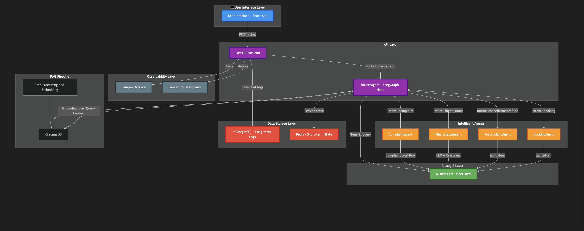

# Agentic Chatbot

Agentic Chatbot is a FastAPI-based conversational AI system designed to assist users with travel-related queries. It uses a modular architecture with agents and nodes to handle tasks such as booking, flight status, and more. The system is powered by a configurable LLM backend (e.g., Mistral) for natural language understanding and response generation.

---

## Table of Contents

- [Features](#features)
- [Project Structure](#project-structure)
- [Setup and Installation](#setup-and-installation)
- [Environment Variables](#environment-variables)
- [Usage](#usage)
- [Testing](#testing)
- [Troubleshooting](#troubleshooting)
- [License](#license)

---

## Features

- **WebSocket-based Chat Interface**: Real-time communication with the chatbot.
- **Modular Agent Architecture**: Includes RouterAgent, BookingAgent, and FlightStatusAgent.
- **LLM Integration**: Supports Mistral or other backends for natural language processing.
- **Redis Integration**: Stores session states and conversation history.
- **Extensible Design**: Easily add new agents or nodes for additional functionality.

---

## High-Level Architecture



---

## Project Structure

```
Agentic-Chatbot/
├── api/
│   └── chat.py               # FastAPI WebSocket and REST endpoints
├── clients/
│   └── chat_test_client.py   # Test client for interacting with the chatbot
├── src/
│   ├── ai_agent/
│   │   ├── agents/           # Agent implementations (RouterAgent, BookingAgent, etc.)
│   │   ├── configs/          # Configuration files
│   │   ├── graph/            # Graph-based agent routing logic
│   │   ├── nodes/            # Nodes for specific tasks (e.g., booking, flight status)
│   │   ├── state/            # Conversation state management
│   │   └── utils/            # Utility functions (e.g., Redis helpers)
├── ui/
│   ├── src/                  # React-based frontend source code
│   ├── public/               # Static assets for the UI
│   └── package.json          # Frontend dependencies
├── test/
│   ├── test_booking_agent.py # Unit tests for BookingAgent
│   ├── test_router_agent.py  # Unit tests for RouterAgent
│   └── ...                   # Other test files
├── .env                      # Environment variables
├── requirements.txt          # Python dependencies
└── README.md                 # Project documentation
```

---

## Setup and Installation

### Prerequisites

- Python 3.11 or higher
- Redis (for session and history storage)
- Mistral model or other LLM backend (if applicable)

### Installation Steps

1. **Clone the Repository**:
   ```bash
   git clone https://github.com/your-username/Agentic-Chatbot.git
   cd Agentic-Chatbot
   ```

2. **Set Up a Virtual Environment**:
   ```bash
   python3 -m venv venv
   source venv/bin/activate
   ```

3. **Install Dependencies**:
   ```bash
   pip install -r requirements.txt
   ```

4. **Configure Environment Variables**:
   - Create a `.env` file in the project root:
     ```bash
     cp .env.example .env
     ```
   - Update the `.env` file with the required values (see Environment Variables).

5. **Start Redis**:
   Ensure Redis is running locally or update the connection details in the configuration.

6. **Run the Application**:
   ```bash
   uvicorn api.chat:app --reload
   ```

---

## Environment Variables

The project uses a `.env` file to manage configuration. Below are the key variables:

| Variable                | Description                                      | Default Value                     |
|-------------------------|--------------------------------------------------|-----------------------------------|
| LLM_BACKEND             | Backend for the LLM (e.g., `mistral`)            | `mistral`                        |
| MISTRAL_MODEL_PATH      | Path to the Mistral model file                   | `models/mistral-7b-instruct-v0.2.Q4_K_M.gguf` |
| REDIS_HOST              | Redis server hostname                           | `localhost`                      |
| REDIS_PORT              | Redis server port                               | `6379`                           |

---

## Usage

### WebSocket Chat

1. Start the server:
   ```bash
   uvicorn api.chat:app --reload
   ```

2. Use the test client to interact with the chatbot:
   ```bash
   python clients/chat_test_client.py
   ```

3. Type your queries in the client, and the chatbot will respond in real-time.

### REST Endpoints

- **Root Endpoint**:
  ```bash
  GET /
  ```
  Returns the status of the chatbot.

- **Conversation History**:
  ```bash
  GET /history/{session_id}
  ```
  Retrieves the conversation history for a given session.

- **Chat WebSocket**:
  ```bash
  ws://<host>:<port>/chat
  ```
  Establishes a WebSocket connection for real-time chat with the bot.

---

## Testing

1. **Run the Test Client**:
   ```bash
   python clients/chat_test_client.py
   ```

2. **Unit Tests**:
   Add unit tests for agents, nodes, and other components in the `tests/` directory. Run tests using:
   ```bash
   pytest
   ```

---

## Troubleshooting

### Common Issues

1. **Redis Connection Error**:
   - Ensure Redis is running locally or update the connection details in the `.env` file.

2. **LLM Model Not Found**:
   - Verify the `MISTRAL_MODEL_PATH` in the `.env` file points to the correct model file.

3. **WebSocket Disconnects**:
   - Check the server logs for errors and ensure the client is sending valid JSON messages.

4. **`updated_state` is `None`**:
   - Debug the `graph.ainvoke()` method and ensure all agents return a valid `ConversationState`.

---

## License

This project is licensed under the MIT License.

---

## Contributing

Contributions are welcome! Please open an issue or submit a pull request for any improvements or bug fixes.